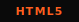
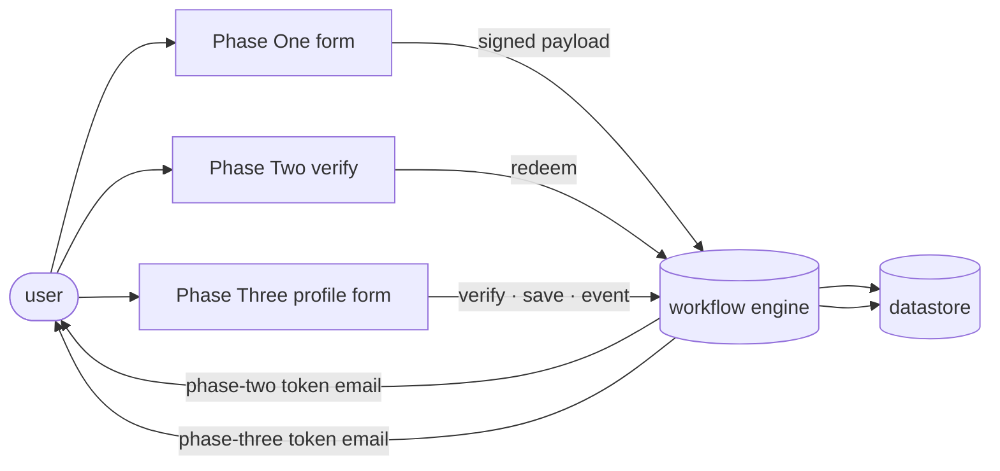
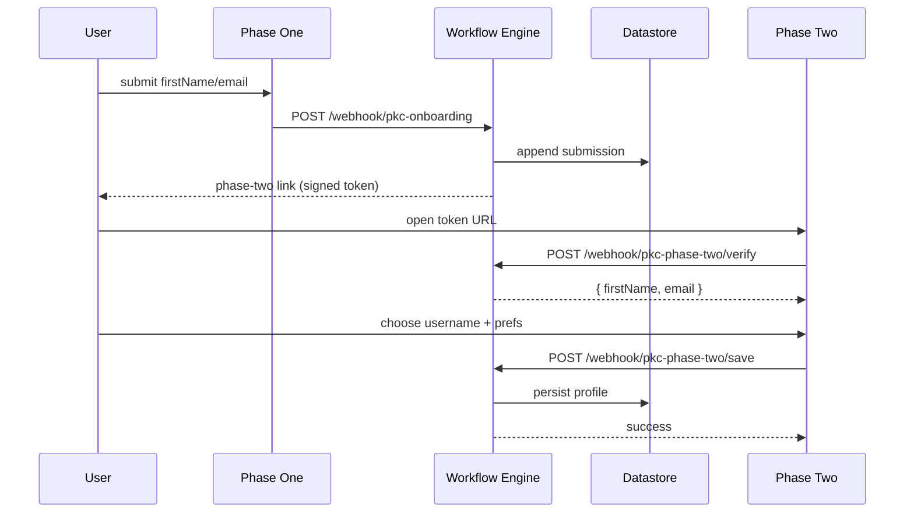

```
// ────────────────────────────────────── //
// PROJECT KID CREATIONS                  //
// PHASE ONE → PHASE TWO → PHASE THREE    //
// ACCESS GRANTED (upcoming)              //
// ────────────────────────────────────── //
```

<div align="center">

<sub>// STATUS</sub>

[](https://vercel.com/maxwell-willis-projects/projectkidcreations) &middot; [](https://github.com/AlxanderArt/ProjectKidCreations/commits/main) &middot; 

 &middot;  &middot;  &middot; 

<sub>// STACK</sub>

<a href="https://developer.mozilla.org/docs/Web/HTML" title="HTML5"></a>&nbsp;<a href="https://developer.mozilla.org/docs/Web/JavaScript" title="Vanilla JS — no framework"></a>&nbsp;<a href="https://n8n.io" title="n8n — workflow engine"></a>&nbsp;<a href="https://developers.google.com/sheets/api" title="Google Sheets — append-only datastore"></a>&nbsp;<a href="https://vercel.com" title="Vercel — static hosting"></a>

<sub>// LICENSE</sub>

`// ALL RIGHTS RESERVED · © 2026 ALXANDERART`

</div>

<!-- TODO: screenshot — phase-one form hero -->

---

## // PROJECT KID CREATIONS

A three-phase onboarding system for kids who create. Phase One captures intent. Phase Two confirms the email and unlocks the next step. Phase Three builds the operator profile — identity, loadout interests, logistics. Phase Four (codename **ACCESS GRANTED**, upcoming) is the verified-state dashboard where the accent flips from hi-vis orange to neon green to signal you're in. The whole thing is built brutalist — hi-vis on tac-black, monospace, no decoration that doesn't earn its place.

---

## // LIVE

-  **Phase One** → https://projectkidcreations.io/
-  **Phase Two** → token-gated (signed link emailed after Phase One)
-  **Phase Three** → token-gated (signed link emailed after Phase Two redemption)
-  **Phase Four · ACCESS GRANTED** → verified-state dashboard (planning complete, gated on Supabase)

> Token-gated phases never expose a bare URL — the only way in is through the signed link.

---

## // SYSTEM_MAP

Three tiers, named not detailed:

- **Frontend** — static, Vercel-hosted, vanilla HTML / CSS / JS
- **Orchestration** — n8n workflow engine on a private VPS, signs tokens, persists submissions
- **Datastore** — Google Sheets (managed, append-only audit trail)



---

## // ENDPOINTS

| Endpoint | Method | Purpose |
| --- | --- | --- |
| `/webhook/pkc-onboarding` | POST | Submit Phase One (firstName, email) |
| `/webhook/pkc-phase-two/verify` | POST | Verify Phase 2 token |
| `/webhook/pkc-phase-two/save` | POST | Redeem Phase 2 token, write `redeemed_at`, trigger Phase 3 email |
| `/webhook/pkc-phase-two/event` | POST | Phase 2 client telemetry |
| `/webhook/pkc-phase-three/verify` | POST | Verify Phase 3 token + Phase 2 redemption |
| `/webhook/pkc-phase-three/save` | POST | Persist full operator profile (27 fields) |
| `/webhook/pkc-phase-three/check-username` | POST | Debounced availability lookup |
| `/webhook/pkc-phase-three/event` | POST | Phase 3 client telemetry |

> Public surface only. Hostnames live outside the repo.

---

## // PHASE_FLOW



Phase One signs its payload with **SHA-256** over sorted-key JSON for tamper detection. Phase Two tokens are **HMAC-SHA256** over `email | issued_at | expires_at | submissionId`, base64url-encoded, with a 14-day TTL and a 60-second clock-drift grace.

**Logical profile fields:** `firstName` · `email` · `username` · `theme` · `notifications` · `submissionId`

<!-- TODO: screenshot — phase-two profile page -->

---

## // DESIGN_DECISIONS

- **HMAC-SHA256 over JWT.** Lighter, fewer moving parts. We don't need claims — we need a signed pointer to a row. JWT brings public-key complexity and library churn we don't need at this scale.
- **14-day TTL.** Long enough to cover an inattentive week + weekend without nagging the user. Short enough that a leaked link can't be replayed weeks later.
- **Stateless token, no server session.** No session table to scale, no logout endpoint, no revocation drama. The token IS the session. "Already completed" checks live in the datastore as a single boolean.
- **Sorted-key SHA-256 hash on Phase One.** JSON is non-canonical; key order drifts between browsers and engines. Sorted keys make the hash deterministic.
- **Two-phase model at all.** Phase One captures intent before friction. Phase Two captures preference after the user has felt the brand once. Splitting the form keeps Phase One's conversion clean and lets Phase Two iterate without touching the funnel above it.
- **Brutalist `// COMMENT` microcopy.** Not nostalgia — signal density. Monospace lines and slash markers make the page legible at a glance, without decoration competing for attention. The brand is a tool, not a billboard.

---

## // FILES

| Path | Purpose |
| --- | --- |
| `index.html` | Phase One landing |
| `app.js` | Phase One state + submit |
| `styles.css` | Brand styling |
| `phase-two/index.html` | Phase Two confirm-email page |
| `phase-two/app.js` | State machine + verify/redeem |
| `phase-two/styles.css` | Phase 2 styling + verified-state accent swap |
| `phase-two/motion.js` | GSAP entrance choreography + orange→green flip |
| `phase-three/index.html` | Phase Three profile-creation page |
| `phase-three/app.js` | 11-state machine + 4-section form |
| `phase-three/styles.css` | Phase 3 styling (extends phase-two tokens) |
| `phase-three/motion.js` | GSAP entrance + section transitions |
| `phase-three/upload-worker.js` | Avatar client-side pipeline (parked until Vercel Blob is wired) |
| `api/phase-two/{verify,save,event}.js` | Vercel proxies to n8n (save is Node runtime · 60s) |
| `api/phase-three/{verify,save,event,check-username}.js` | Vercel proxies to n8n |
| `assets/badges/` | Bespoke flat-square SVG badges |
| `assets/screenshots/` | UI captures (TODO) |
| `README.template.md` | Reusable template — re-render via the github-proper-setup skill |

---

## // GOTCHAS

- **Phase One must succeed for Phase Two to render correctly.** Phase Two's verify reads the submission row by `submissionId`. No row → "WELCOME / —" instead of "HI, FIRSTNAME".
- **Token TTL is 14 days.** Past that, the verify endpoint returns `EXPIRED` and the page enters its EXPIRED state.
- **The form's SHA-256 hash uses sorted keys.** Client and verifier must agree on canonical order — don't mutate this without updating both sides.
- **Phase Two has 9 states.** LOADING → INVALID / EXPIRED / ALREADY_DONE / FORM → SUBMITTING → SUCCESS / ERROR_RETRY / ERROR_FATAL. A 12-second loading timeout fires ERROR_RETRY. A 1.5-second auto-retry happens once. A 90-second abandon watcher emits a telemetry event when a user stalls in FORM.
- **`<!-- TODO: screenshot -->`** markers exist for Phase One and Phase Two captures. Drop PNGs into `assets/screenshots/` and the markers resolve.

---

## // LICENSE

Copyright © 2026 AlxanderArt. All rights reserved. See `LICENSE` for the full notice.
